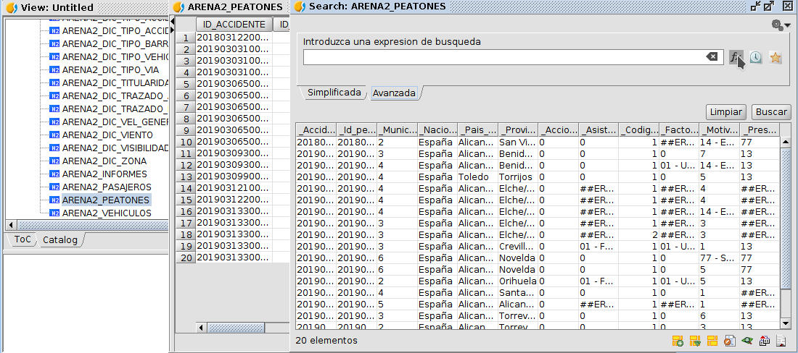
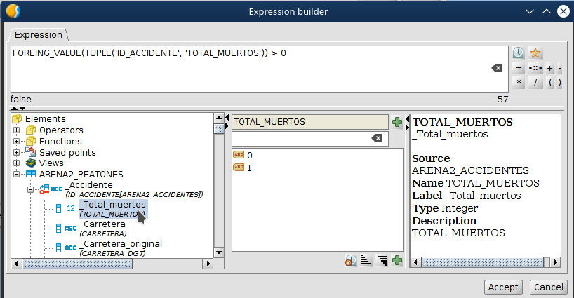
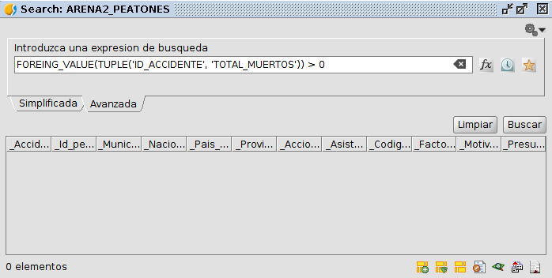

 encoding: utf-8 

 Localizacion peatones implicados en accidentes mortales 

El ejemplo es muy similar al ejemplo anterior, solo que para conocer los 
peatones implicados en accidentes mortales lo primero es ir a la tabla de 
Peatones, desde esta tabla realizaremos la búsqueda. En esta ocasión, se 
utilizará la búsqueda avanzada.

El primer paso es abrir la tabla ARENA2_PEATONES como lo anteriormente explicado 
y acceder a la herramienta de Búsqueda. Tras esto acceder a la ficha de búsqueda 
avanzada. Para  crear una expresión presionamos sobre el botón Fx.

En el menú de la izquierda, buscaremos el campo de la tabla de peatones que 
tiene relación con la tabla de accidentes, ya que el campo que necesitamos 
TOTAL_MUERTOS, se encuentra en esa tabla. Este campo ID_ACCIDENTE es el que 
relaciona ambas tablas.

Al presionar dos veces sobre el campo se puede ver que automáticamente inserta 
el nombre del campo de una manera especial en la expresión, ya que está indicando 
también a través de qué campo se está realizando la relación. Le indicamos que ese 
campo debe ser mayor de cero.

En esta ventana también se puede apreciar el nombre de las etiquetas que se le 
pueden dar a las tablas o campos para que sean de mejor lectura para el usuario.

En este caso, el resultado de la búsqueda devuelve 0 elementos.

